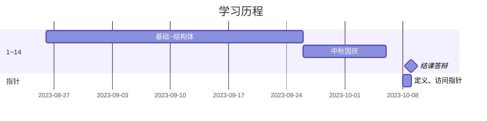

---
tags:
  - C语言/根
aliases:
  - C语言笔记-目录
---
1. [[基础]]
2. [[文件包含（预处理）]]
3. [[C语言笔记/函数/函数-简介]]
4. [[C语言笔记/变量&作用域/作用域-简介|作用域]]
5. [[标识符命名规则]]
6. [[C语言笔记/数据类型]]
7. [[转义字符]]
8. [[C语言笔记/分支结构/分支结构-简介|分支结构]]
9. [[循环结构-简介|循环结构]]
10. [[运算符-简介|运算符]]
11. [[数组-简介|数组]]
12. [[字符串]]
13. [[结构体-简介|结构体]]
14. [[C语言笔记/结课答辩/结课答辩_蔡.canvas|结课答辩_蔡]]
	- [[C语言笔记/结课答辩/二十进制转换代码|二十进制转换代码]]
15. [[C语言笔记/指针/指针-简介|指针]]

# 甘特图(test)

---
【1】[C 语言教程 | 菜鸟教程 (runoob.com)](https://www.runoob.com/cprogramming/c-tutorial.html)