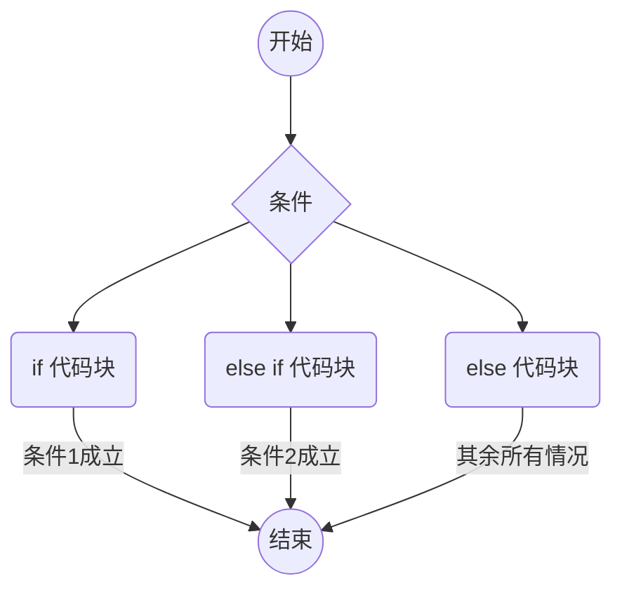
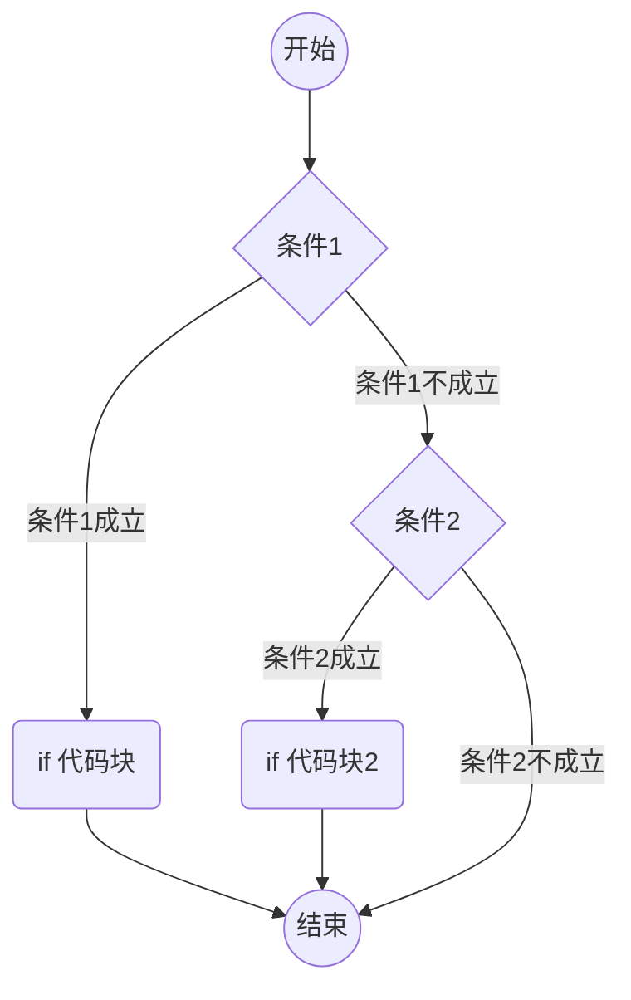

---
tags:
  - 内容
aliases:
---
`if语句`通常被称为选择语句或分支语句。

 它不再局限于顺序结构单一流程，而是用来对给定条件进行判定，根据其判定结果，从两种操作中选择其一。

 if语句用于实现分支结构，C语音提供了两种形式的if语句。

# 单分支

 一般形式：if(表达式) 语句。

 ```c
 if(boolean_expression)
 {
 /* 如果布尔表达式为真将执行的语句 */
 }
 
 ```

 执行过程如图所示：

 ```mermaid
 graph TD
 A((开始))
 A-->B{条件}
 B-->|如果条件是false|D((结束))
 B-->|如果条件是true|C(条件代码)
 C-->D
 ```

## 说明

 1.  执行if语句时，先对“表达式”进行求值，如果计算结果非0（为真），则执行其后的“语句”，否则跳过其后的“语句”。
 2.  “表达式”的类型可以为任何类型的表达式。

## 表达式

 表达式（Expression）是由变量、常量、运算符和函数调用等元素组合而成的代码片段，它们用于计算并产生一个值。表达式通常描述了某种计算或操作，计算结果可以是一个数字、一个字符串、一个布尔值等等，具体取决于表达式中的元素和运算符。

# 双分支

 ```C
 if(boolean_expression)
 {
  /* 如果布尔表达式为真将执行的语句 */
 }
 else
 {
  /* 如果布尔表达式为假将执行的语句 */
 }
 
 ```

 执行过程如图所示：

 ```mermaid
 graph TD
 A((开始))-->B{条件}
 B-->|如果条件是true|C(if 代码块)
 B-->|如果条件是false|D(else 代码块)
 C-->E((结束))
 D-->E((结束))
 
 ```

# 多分支结构

一个 **if** 语句后可跟一个可选的 **else if...else** 语句，这可用于测试多种条件。

当使用 if...else if...else 语句时，以下几点需要注意：

-   一个 if 后可跟零个或一个 else，else 必须在所有 else if 之后。
-   一个 if 后可跟零个或多个 else if，else if 必须在 else 之前。
-   一旦某个 else if 匹配成功，其他的 else if 或 else 将不会被测试。

```c
if(boolean_expression 1)
{
   /* 当布尔表达式 1 为真时执行 */
}
else if( boolean_expression 2)
{
   /* 当布尔表达式 2 为真时执行 */
}
else if( boolean_expression 3)
{
   /* 当布尔表达式 3 为真时执行 */
}
else 
{
   /* 当上面条件都不为真时执行 */
}

```

执行过程如图所示：



![[switch语句|Switch语句]]

# 嵌套分支结构

在 C 语言中，**嵌套** if-else 语句是合法的，这意味着您可以在一个 **if** 或 **else if** 语句内使用另一个 **if** 或 **else if** 语句。

```c
if( boolean_expression 1)
{
 /* 当布尔表达式 1 为真时执行 */
 if(boolean_expression 2)
 {
    /* 当布尔表达式 2 为真时执行 */
 }
}
```

执行流程如图所示：




