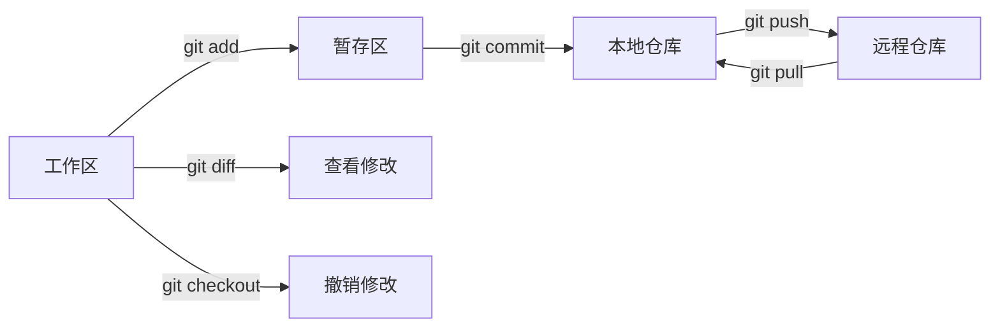

---
tags:
  - 根
aliases:
  - git笔记
  - git目录
  - git 笔记
  - git 目录
cssclasses: 
时间: 2023-11-28
---

### Git 仓库状态

#### 1. 仓库状态概述

Git 是一款分布式版本控制系统，通过记录文件的历史变更，帮助团队协作、追踪项目进度，并提供了强大的版本管理功能。了解仓库状态是使用 Git 的基本需求之一。

#### 2. 查看仓库状态

- 使用以下命令查看仓库状态：
  ```bash
  git status
  ```

- `git status` 命令会显示当前分支、未暂存的修改和未跟踪的文件等信息。

#### 3. 工作区、暂存区和本地仓库

- **工作区（Working Directory）：** 是项目文件的当前状态，包括已修改、未修改和未跟踪的文件。

- **暂存区（Staging Area）：** 是一个临时区域，用于存放将要提交的修改。通过 `git add` 命令将工作区的修改添加到暂存区。

- **本地仓库（Local Repository）：** 包含了完整的版本历史，通过 `git commit` 命令将暂存区的修改提交到本地仓库。

#### 4. 常见状态

- **未跟踪文件：** 出现在 "Untracked files" 部分，表示 Git 尚未开始跟踪的文件。

- **未暂存的修改：** 出现在 "Changes not staged for commit" 部分，表示工作区有修改，但尚未添加到暂存区。

- **已暂存的修改：** 出现在 "Changes to be committed" 部分，表示已将修改添加到暂存区，准备提交到本地仓库。

#### 5. 常用操作

- **添加文件到暂存区：**
  ```bash
  git add <file>
  ```

- **提交暂存区的修改到本地仓库：**
  ```bash
  git commit -m "Commit message"
  ```

- **查看具体修改：**
  ```bash
  git diff
  ```

- **撤销工作区的修改：**
  ```bash
  git checkout -- <file>
  ```

#### 6. 解决合并冲突

- **拉取远程更改：**
  ```bash
  git pull origin master
  ```

- **解决合并冲突：** 当 `git pull` 导致合并冲突时，手动解决冲突并提交。

#### 7. 推送本地更改到远程仓库

- **推送到远程仓库：**
  ```bash
  git push origin master
  ```

- 如果推送失败，可能需要先拉取远程更改，解决冲突，然后再推送。

#### 8. 总结

Git 仓库状态提供了对项目变更的清晰视图，有效管理代码修改、合并冲突，保持团队协作的高效性。通过掌握仓库状态的概念和常用操作，可以更好地利用 Git 进行版本控制。