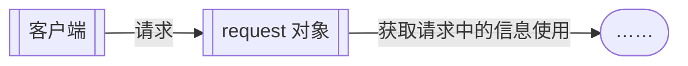

---
tags:
  - JAVA/JAVA_WEB
  - 内容
aliases: 
日月: 2024-08-29
时分: 11:23
---
- request对象主要用于处理客户端请求

| 方法名称                                                   | 说明                                                |
| ------------------------------------------------------ | ------------------------------------------------- |
| String getParameter(String name)                       | 根据表单组件名称获取提交数据                                    |
| String[] getParameterValues(String name)               | 获取表单组件对应多个值时的请求数据                                 |
| void setCharacterEncoding(String charset)              | 指定每个请求的编码                                         |
| RequestDispatcher getRequestDispatcher(String path) | 返回一个`RequestDispatcher`对象，该对象的`forward()`方法用于转发请求 |
