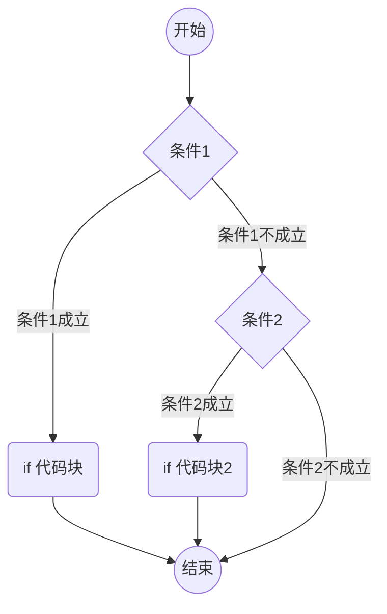

---
tags:
  - JAVA/内容
aliases: 
日月: 2024-04-23
时分: 10:55
---
`if-else`语句是Java编程中的基本控制结构，用于根据条件执行不同的代码块。下面是`if-else`语句的基本语法和使用方法的详细讲解：

### 基本语法

```java
if (condition) {
    // 当条件为真（true）时执行这里的代码
} else {
    // 当条件为假（false）时执行这里的代码
}
```

### 示例

```java
int number = 10;

if (number > 0) {
    System.out.println("数字是正数");
} else {
    System.out.println("数字是非正数");
}
```

 ```mermaid
 graph TD
 A((开始))
 A-->B{条件}
 B-->|如果条件是false|D((结束))
 B-->|如果条件是true|C(执行代码块)
 C-->D
 ```
### 多重条件

你可以使用`else if`来检查多个条件：

```java
int score = 85;

if (score >= 90) {
    System.out.println("优秀");
} else if (score >= 80) {
    System.out.println("良好");
} else if (score >= 70) {
    System.out.println("中等");
} else if (score >= 60) {
    System.out.println("及格");
} else {
    System.out.println("不及格");
}
```

### 嵌套`if-else`

`if-else`语句也可以嵌套，即在一个`if`或`else`块内包含另一个`if-else`块：
 
```java
int x = 10;
int y = 20;

if (x == 10) {
    if (y == 20) {
        System.out.println("x是10且y是20");
    }
} else {
    System.out.println("x不是10");
}
```


### 注意事项

- 每个`if`后面可以跟随一个`else`块，但只有一个`if`块。
- 条件表达式必须返回`boolean`值（`true`或`false`）。
- `if-else`语句可以嵌套使用，但应注意代码的可读性。

### 总结

`if-else`语句提供了一种在程序中基于条件执行代码块的方式。通过组合`if`、`else if`和`else`，你可以实现更复杂的逻辑流程，从而使你的程序更加灵活和功能强大。希望这个讲解能帮助你更好地理解和使用`if-else`语句！