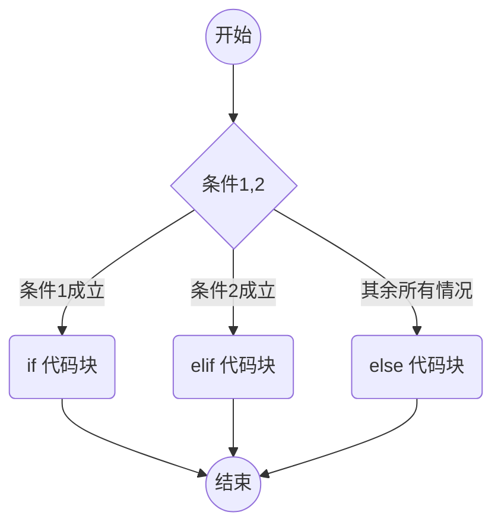

---
tags:
  - Python/内容
时间: 2023-12-25
---
>[!info] 分支结构是编程中的一种控制结构，用于根据某个条件的真假来选择性地执行不同的代码块。在Python中，分支结构主要由`if`语句、`else`语句和`elif`语句组成。

 `if-elif-else`语句离不开==关系表达式==，即==条件==，关系表达式一般由[[Python/变量和数据类型/Python-变量|变量]]、[[Python/Python 运算符#比较运算符|比较运算符]]和[[Python/Python 运算符#逻辑运算符|逻辑运算符]]组成。这点和C语言中的[[C语言笔记/分支结构/关系表达式|关系表达式]]没有差别.

在判断元素是否存在于列表或其他可迭代元素中时，可以使用[[Python/控制流和循环结构/in-关键字|in]]关键字。

---

### `if` 语句

`if`语句用于执行一个代码块，如果给定条件为真（True）。其基本语法如下：

```python
if condition:
    # 如果条件为真，执行此处的代码块
```
**流程图：**
 ```mermaid
 graph TD
 A((开始))
 A-->B{条件}
 B-->|如果条件是false|D((结束))
 B-->|如果条件是true|C(执行代码块)
 C-->D
 ```

---

### `if` 和 `else` 语句

`else`语句用于在`if`条件为假时执行另一个代码块。其基本语法如下：

```python
if condition:
    # 如果条件为真，执行此处的代码块
else:
    # 如果条件为假，执行此处的代码块
```
**流程图：**
```mermaid
 graph TD
 A((开始))-->B{条件}
 B-->|如果条件是true|C(if 代码块)
 B-->|如果条件是false|D(else 代码块)
 C-->E((结束))
 D-->E((结束))
 
 ```
---
### `if`、`elif` 和 `else` 语句

`elif`语句（缩写为"else if"）用于检查多个条件。它在之前的`if`条件为假时检查其条件。其基本语法如下：

```python
if condition1:
    # 如果条件1为真，执行此处的代码块
elif condition2:
    # 如果条件1为假且条件2为真，执行此处的代码块
else:
    # 如果所有条件都为假，执行此处的代码块
```
**流程图**：

==无论是 `if` `elif` 还是 `else` 都支持嵌套使用分支结构。==

---

### 示例

以下是一个简单的示例，演示了分支结构的使用：

```python
x = 10

if x > 0:
    print("x 是正数")
elif x == 0:
    print("x 是零")
else:
    print("x 是负数")
```

在这个例子中，根据变量 `x` 的值，程序选择性地执行了不同的输出。分支结构允许程序根据条件做出决策，这对于根据不同情况执行不同的代码块是非常有用的。
