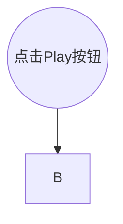
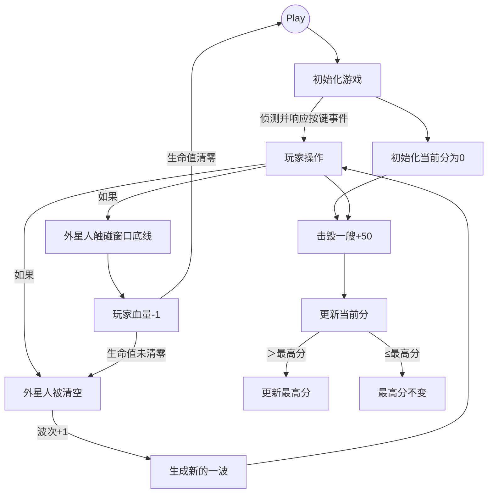

```mermaid
graph TD
A((点击Play按钮))-->B
```

```mermaid
graph TD 
A((Play)) --> B[初始化游戏]
B --> |侦测并响应按键事件|C[玩家操作]

C --> |如果|D1[外星人被清空]
D1 --> |波次+1|D2[生成新的一波]
D2 --> C

C -->|如果|E1[外星人触碰窗口底线]
E1 --> E2[玩家血量-1]
E2 --> |生命值未清零|D1
E2 --> |生命值清零|A

B --> F1[初始化当前分为0]
F1 --> F
C --> F[击毁一艘+50]
F --> G[更新当前分]
G --> |＞最高分|H1[更新最高分]
G --> |≤最高分|H2[最高分不变]

```
