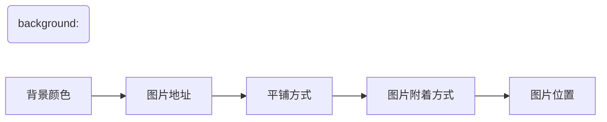

---
tags:
  - CSS/属性
  - 内容
---
# 背景属性[^1]

| 属性                  | 描述                                       | CSS |
| ----------------------- | ---------------------------------------- | --- |
| `background`             | 复合属性。设置对象的背景特性。            | 1   |
| `background-attachment`  | 设置或检索背景图像是随对象内容滚动还是固定的。必须先指定background-image属性。 | 1   |
| `background-color`       | 设置或检索对象的背景颜色。               | 1   |
| `background-image`       | 设置或检索对象的背景图像。               | 1   |
| `background-position`    | 设置或检索对象的背景图像位置。必须先指定background-image属性。 | 1   |
| `background-repeat`       | 设置或检索对象的背景图像如何铺排填充。必须先指定background-image属性。 | 1   |
| `background-clip`         | 指定对象的背景图像向外裁剪的区域。       | 3   |
| `background-origin`     | 设置或检索对象的背景图像计算background-position时的参考原点(位置)。 | 3   |
| `background-size`         | 检索或设置对象的背景图像的尺寸大小。     | 3   |

[^1]: 详见：[菜鸟教程-CSS3背景属性](https://www.runoob.com/cssref/css-reference.html#background:~:text=3-,%E8%83%8C%E6%99%AF%E5%B1%9E%E6%80%A7,-%E5%B1%9E%E6%80%A7)

---
## background-image 背景图片

装饰性图片、logo或者超大图片，可以使用背景图片来展示，这是因为背景图片的位置比较容易控制。
通过 `background-repeat` 来控制平铺方式。使用 `background-position` 来控制图片位置。

页面元素既可以添加背景图片也可以设置背景颜色，背景图片会在背景颜色之上。

---
## background-position 背景图片位置

1. 参数是方位名词
	- 如果指定的两个值都是方位名词，则两个值前后顺序无关，比如 `left top` 和 `top left` 效果一样。
	- 如果只指定了一个方位名词，则第二个值默认是 `center`
2. 参数是精确单位
	- 如果参数值是精确坐标，那么第一个值为X坐标，第二个值为Y坐标，原点始终为左上角。
	- 如果只指定一个坐标，那么只能是X坐标，另一个值是 `center`。
3. 如果是混合单位
	- 如果指定的两个值是精确单位和方位名词混合使用，则第一个值是X坐标，第二个是Y坐标。

---
## background-size 背景图像大小[^2]

|`background-size`值|描述|
|:--|:--|
|`length`|设置背景图片高度和宽度。第一个值设置宽度，第二个值设置的高度。如果只给出一个值，第二个是设置为 `auto`(自动)|
|`percentage`|将计算相对于背景定位区域的百分比。第一个值设置宽度，第二个值设置的高度，各个值之间以空格 隔开指定高和宽，以逗号 , 隔开指定多重背景。如果只给出一个值，第二个是设置为"auto(自动)"|
|`cover`|此时会保持图像的纵横比并将图像缩放成将完全覆盖背景定位区域的最小大小。|
|`contain`|此时会保持图像的纵横比并将图像缩放成将适合背景定位区域的最大大小。|

[^2]:详见：[CSS3 background-size 属性 | 菜鸟教程 (runoob.com)](https://www.runoob.com/cssref/css3-pr-background-size.html)

---

## background-attachment 背景附着

| 参数     | 作用                   |
| -------- | ---------------------- |
| `scroll` | 背景图像岁对象内容滚动 |
| `fixed`  | 背景图像固定                       |

可以通过`background-attachment`来实现视差滚动效果。

---

## background 综合属性

当使用简写属性时，没有特定的书写顺序，一般习惯约定的顺序为：

